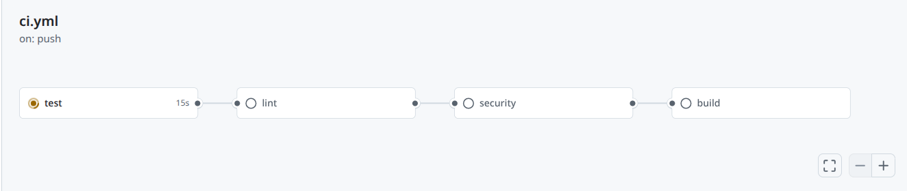
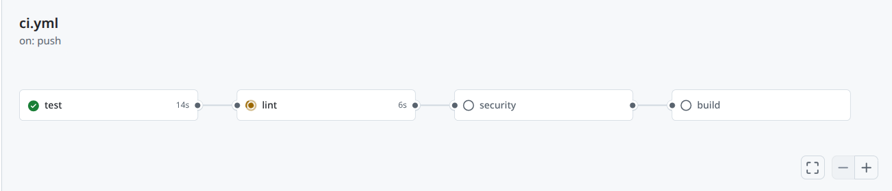
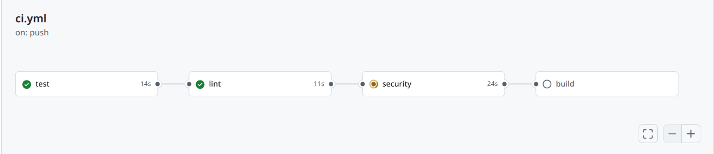
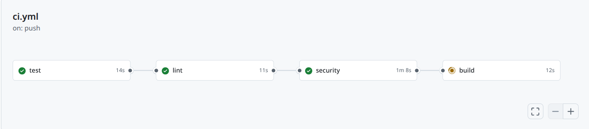
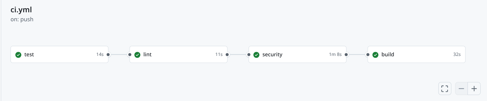
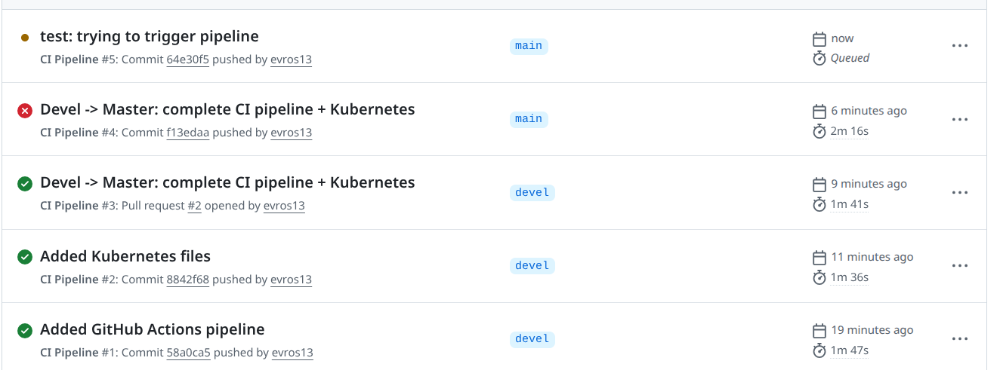
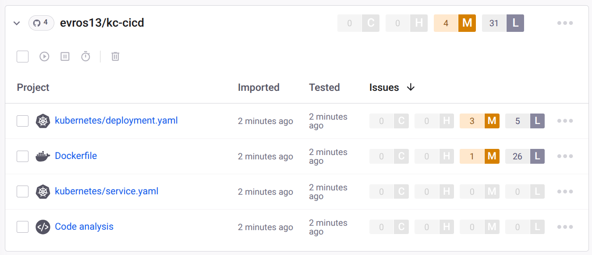
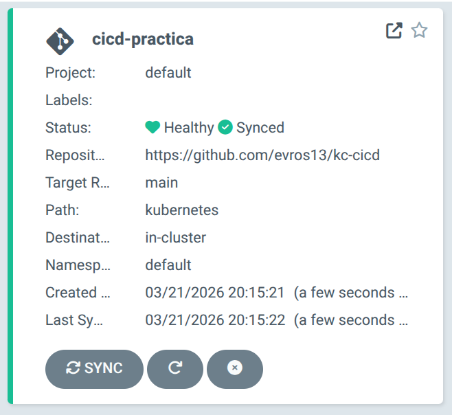
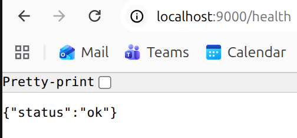

# Pipeline CI/CD con GitHub Actions, Docker y ArgoCD
---

- [Descripción y Estructura del Proyecto](#descripción-y-estructura-del-proyecto)
- [Requisitos Previos](#requisitos-previos)
- [Instalación y Configuración](#instalación-y-configuración)
- [Git Flow](#git-flow)
- [Pipeline de CI/CD](#pipeline-de-cicd)
- [Docker](#docker)
- [Despliegue con ArgoCD en Kubernetes](#despliegue-con-argocd-en-kubernetes)
- [Conclusión](#conclusión)

---

## Descripción y Estructura del Proyecto

Este proyecto implementa un pipeline de CI/CD completo para una API REST escrita en Python con FastAPI. La aplicación gestiona una lista de tareas (to-do list) y está completamente contenerizada con Docker. El pipeline abarca toda la parte de CI (Continuous Integration) con los tests, lint, análisis estático, Snyk y Docker así como la de CD (Continuous Deployment), que incluye el despliegue en un cluster de Kubernetes usando ArgoCD.

La estructura del proyecto es la siguiente:

```
project/
├── .github/
│   └── workflows/
│       └── ci.yml            # Definición del pipeline de GitHub Actions
├── app/
│   ├── __init__.py
│   └── main.py               # Código principal de la API (FastAPI)
├── kubernetes/
│   ├── deployment.yaml       # Manifiesto de Deployment para Kubernetes
│   └── service.yaml          # Manifiesto de Service para Kubernetes
├── tests/
│   ├── __init__.py
│   └── test_main.py          # Tests de la API con pytest
├── Dockerfile                # Definición de la imagen Docker
└── requirements.txt          # Dependencias del proyecto
```

### Componentes de la API

La aplicación expone tres endpoints:

`GET /health` → Verifica que la app está viva tanto por el pipeline como por las probes de Kubernetes. Es el healthcheck de la aplicación.

`GET /tasks` → Devuelve la lista de tareas actual.

`POST /tasks` → Crea una tarea nueva. Está configurado para que devuelva un error 400 si ya existe una tarea con el mismo ID.

`DELETE /tasks/{task_id}` → Elimina una tarea por su ID. Si se introduce un ID que no existe, devuelve un error 404.

### Componentes del Pipeline

`test` → Ejecuta los tests con pytest y genera un informe de cobertura de código en formato XML.



`lint` → Ejecuta flake8 para comprobar el estilo del código (PEP8) y bandit para el análisis estático de seguridad. Solo se ejecuta si el job `test` ha pasado (esto se consigue mediante la opción de "needs"):
``` bash
needs: test
```


`security` → Ejecuta un análisis de vulnerabilidades en las dependencias usando Snyk. Igual que "lint" con "test", solo se ejecuta si el job `lint` ha pasado.



`build` → Construye la imagen Docker y la publica en Docker Hub. Solo se ejecuta en la rama `main` gracias a esta parte del código 
```bash
 if: github.ref == 'refs/heads/main' 
 ```



Si todo va correctamente, te aparecerán todos los tests en verde:



### Flujo del Pipeline

```
push / pull_request
        │
        ▼
      test ──────────────────────────────────────────► ✅ / ❌
        │
        ▼ (solo si test pasa)
      lint ──────────────────────────────────────────► ✅ / ❌
        │
        ▼ (solo si lint pasa)
    security ─────────────────────────────────────────► ✅ / ❌
        │
        ▼ (solo si security pasa && estamos en main)
      build ─────────────────────────────────────────► se publica imagen en Docker Hub
```

---

## Requisitos Previos

Antes de empezar, asegúrate de tener instalado:

- **Python** >= 3.13
- **Docker**
- **Minikube**
- **kubectl**

También asegúrate de crear una cuenta *gratuita* en las siguientes plataformas:

- **GitHub** (el repositorio tiene que ser público)
- **Docker Hub**
- **Snyk**

Para comprobar que tienes todo instalado:

```bash
python3 --version
docker --version
minikube version
kubectl version --client
```

---

## Instalación y Configuración

### Paso 1: Clonar el Repositorio

Clona este mismo repositorio para tener todos los ficheros. Primero crea y entra en la carpeta donde quieras tener el proyecto y allí ejecuta:

```bash
git clone https://github.com/evros13/kc-cicd.git
cd kc-cicd
```

*IMPORTANTE*! Para que el pipeline funcione necesitas configurar tres secretos en tu repositorio de GitHub ya que no hay ninguna credencial hardcodeada (por buena práctica y seguridad). Accede a la interfaz gráfica de GitHub con tu cuenta y ve a **Settings → Secrets and variables → Actions → New repository secret** y añade:

| Secreto | Descripción |
|---|---|
| `SNYK_TOKEN` | Token de autenticación de Snyk (Account Settings → Auth Token) |
| `DOCKERHUB_USERNAME` | Tu usuario de Docker Hub |
| `DOCKERHUB_TOKEN` | Token de acceso de Docker Hub con permisos Read & Write |

---

### Paso 2: Crear el Entorno Virtual e Instalar Dependencias

Ahora instala todas las dependencias (ya establecidas en requirements.txt).
```bash
python3 -m venv venv
source venv/bin/activate
pip install -r requirements.txt
```

### Paso 3: Ejecutar la Aplicación en Local

Activa la aplicación para poder testearla en local:

```bash
uvicorn app.main:app --reload
```

Ahora, abre el navegador en `http://localhost:8000/health` y deberías ver `{"status":"ok"}`.

También puedes acceder a la documentación interactiva generada automáticamente por FastAPI en `http://localhost:8000/docs`.

### Paso 4: Ejecutar los Tests

Con el entorno virtual activado y la aplicación parada (ctrl+c), puedes ejecutar directamente:

```bash
pytest tests/ -v
```

Para ejecutar los tests con informe de cobertura:

```bash
pytest tests/ -v --cov=app --cov-report=term
```

### Paso 5: Ejecutar el Linting y el Análisis Estático

Primero comprobamos que el estilo del código es el correcto con flake8

```bash
flake8 app/ tests/
```

Luego analizaremos el código en busca de vulnerabilidades de seguridad con bandit

``` bash
bandit -r app/
```

Si flake8 no devuelve nada, el código está limpio. Si bandit no encuentra issues, la salida mostrará `No issues identified.`. Esto lo volveremos a ver en mayor detalle más adelante.


## Git Flow

Este proyecto usa Git Flow para la gestión de ramas:

- **`main`** → Es el código en producción. Aquí se despliega automáticamente con ArgoCD y únicamente se introduce código una vez se hayan hecho todas las comprobaciones y testesos previos.
- **`devel`** → Es la rama de desarrollo. Aquí se integran las features antes de ir a producción. Cualquier problema que pueda aparecer, tiene que ser resuelto aquí antes de ir a main.
- **`feature/xxx`** → Para tener un órden en el código, cada nueva funcionalidad tiene su propia rama, que se mergea a `devel` mediante un Pull Request.

### Flujo de Trabajo

Para entender un poco mejor el funcionamiento del flow, te explicamos. Primero creamos una nueva feature desde devel ejecutando:

```bash
git checkout devel
git checkout -b feature/whatever-new-feature
```

En esa branch, se desarrollará la nueva funcionalidad y se comiteará.

```bash
git add .
git commit -m "feat: descripción de la feature"
git push origin feature/whatever-new-feature
```

Desde la interfaz de GitHub, se creará una Pull Request feature/xxx → devel. Únicamente cuando se haya testeado y comprobado todo, se aprobará la PR y se creará otra nueva devel → main. Aquí, correrá el mismo proceso y se añadirá el paso de build y despliegue. 

---

## Pipeline de CI/CD

El pipeline está definido en `.github/workflows/ci.yml` y se dispara automáticamente en cada `push` o `pull_request` a las ramas `main` y `devel`.

### Job: test (devel y main)

Instala las dependencias y ejecuta los tests con pytest. Genera un informe de cobertura en formato XML que permite ver qué porcentaje del código está cubierto por tests.

### Job: lint (devel y main)

Ejecuta dos herramientas:
- **flake8**: comprueba que el código sigue el estándar de estilo PEP8.
- **bandit**: analiza el código estáticamente en busca de patrones de seguridad problemáticos típicos en Python. 

_**En este proyecto se ha elegido Bandit como herramienta de análisis estático en lugar de SonarCloud porque, al tratarse de un proyecto 100% en Python, ofrece un análisis más específico y adaptado al lenguaje. Además, al integrarse directamente en el pipeline de GitHub Actions, no requiere configuración externa adicional ni cuenta en plataformas de terceros._

### Job: security (devel y main)

Usa la action oficial de **Snyk** para escanear las dependencias del `requirements.txt` en busca de vulnerabilidades conocidas. Para poder hacer este job, necesitaremos tener bien configurado el secreto `SNYK_TOKEN`.

### Job: build (main)

Construye la imagen Docker y la publica en Docker Hub usando las actions oficiales de Docker. Necesitamos bien configurados los secretos `DOCKERHUB_USERNAME` y `DOCKERHUB_TOKEN`.

Podemos ver cómo se van ejecutando los diferentes pasos en GitHub Actions


Aunque Snyk ya está ejecutando los tests sin que nosotros lo vemaos en el job *security*, podemos también añadir el proyecto y analizarlo directamente allí también. 


---

## Docker
 
El `Dockerfile` define cómo se construye la imagen de la aplicación. Para este proyecto se usará una imagen base de Python slim para mantenerla lo más ligera posible. Ésta copia las dependencias, las instala y arranca la app con uvicorn escuchando en el puerto 8000.
 
### Construir la imagen en local
 
```bash
docker build -t cicd-practica .
```
 
### Ejecutar el contenedor en local
 
```bash
docker run -p 8000:8000 cicd-practica
```
 
Ve a `http://localhost:8000/health` y deberías ver `{"status":"ok"}` desde dentro del contenedor.
 
### Imagen publicada en Docker Hub
 
La imagen se publicará automáticamente en Docker Hub al hacer push a `main` gracias a la configuración predefinida en `.github/workflows/ci.yml`. En este proyecto, la imagen creada está en `https://hub.docker.com/r/evros13/cicd-practica`
 
---
 
## Despliegue con ArgoCD en Kubernetes
 
### Componentes de Kubernetes
 
Estos son los elementos que nos permitirán desplegar nuestra aplicación en Kubernetes:
 
`deployment.yaml` → Le dice a Kubernetes cómo ejecutar la aplicación. Define cuántas réplicas del contenedor queremos, qué imagen Docker usar y configura dos probes que usan el endpoint `/health`:
- **livenessProbe**: Kubernetes comprueba periódicamente que la app sigue viva. Si falla, reinicia el contenedor automáticamente.
- **readinessProbe**: Kubernetes comprueba que la app está lista para recibir tráfico antes de enviarle peticiones.
 
`service.yaml` → Expone la aplicación dentro del cluster de Kubernetes. Conecta el Service con el Deployment a través de la etiqueta `app: cicd-practica` y mapea el puerto 80 del Service al puerto 8000 donde escucha nuestra app. Usa tipo `ClusterIP` porque para este proyecto solo necesitamos que sea accesible dentro del cluster; si quieres que se pueda acceder desde fuera del cluster, puedes usar las opciones de `NodePort` o `LoadBalancer` dependiendo de tus necesidades.
 
### Paso 1: Arrancar Minikube
 
```bash
minikube start
```
 
Comprueba que el cluster está listo:
 
```bash
kubectl get nodes
```
 
Deberías ver el nodo con estado *Ready*.
 
### Paso 2: Instalar ArgoCD
 
```bash
kubectl create namespace argocd
kubectl apply -n argocd -f https://raw.githubusercontent.com/argoproj/argo-cd/stable/manifests/install.yaml --server-side
```
 
Espera a que todos los pods estén listos:
 
```bash
kubectl get pods -n argocd
```
 
Todos deberían aparecer como *1/1 Running*.
 
### Paso 3: Acceder a la Interfaz de ArgoCD
 
Expón el servicio en local:
 
```bash
kubectl port-forward svc/argocd-server -n argocd 8080:443
```
 
Para no cancelar el port-forward, abre otra otra terminal y ejecuta el siguiente comando para obtener la contraseña inicial:
 
```bash
kubectl -n argocd get secret argocd-initial-admin-secret -o jsonpath="{.data.password}" | base64 -d
```
 
Abre `https://localhost:8080` en el navegador (acepta la advertencia del certificado), e inicia sesión con:
 
- **Usuario:** `admin`
- **Contraseña:** la que acabas de copiar
 
### Paso 4: Crear la Aplicación en ArgoCD
 
En la interfaz de ArgoCD haz clic en **"+ New App"** y rellena el formulario con estos valores:
 
| Campo | Valor |
|---|---|
| Application Name | `cicd-practica` |
| Project | `default` |
| Sync Policy | `Automatic` |
| Repository URL | `https://github.com/evros13/kc-cicd` |
| Revision | `main` |
| Path | `kubernetes` |
| Cluster URL | `https://kubernetes.default.svc` |
| Namespace | `default` |
 
Haz clic en **"Create"**. ArgoCD leerá los manifiestos de la carpeta `kubernetes/` y desplegará la aplicación automáticamente. Cuando termine, deberías ver esto:



 
### Paso 5: Verificar el Despliegue
 
```bash
kubectl get pods
```
 
Deberías ver el pod de la aplicación con estado `Running`.
 
Para acceder a la app desde local:
 
```bash
kubectl port-forward svc/cicd-practica 9000:80
```
 
Ve a `http://localhost:9000/health` y deberías ver `{"status":"ok"}`.


 
### Despliegue Continuo
 
A partir de aquí, cada vez que se mergee un PR a `main`, el pipeline de GitHub Actions construirá y publicará una nueva imagen en Docker Hub. ArgoCD detectará los cambios en el repositorio y sincronizará automáticamente el cluster con el estado definido en la carpeta `kubernetes/`.
 
---
 
## Conclusión
 
Este proyecto implementa un pipeline de CI/CD completo que cubre todo el ciclo de vida de una aplicación: desde el desarrollo local hasta el despliegue en producción. A través de esta práctica se aprende a estructurar un proyecto Python con FastAPI, gestionar ramas con Git Flow, automatizar la calidad del código con tests, linting y análisis de seguridad, contenerizar aplicaciones con Docker, y desplegar en Kubernetes con ArgoCD de forma completamente automatizada. Espero que haya sido útil. Gracias!
 
---